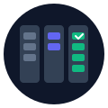

<p align="center">
  
</p>

<h1 align="center">Klarity & Orbit</h1>

<h3 align="center">
  Stop losing track of side projects. <em>Start shipping them.</em>
</h3>

<p align="center">
  <strong>Klarity</strong> — Desktop command center for AI-assisted development.<br/>
  <strong>Orbit</strong> — Mobile companion for capture on the go.
</p>

<p align="center">
  
  
  
  
</p>

<!-- LAUNCHPAD:START
{
  "stage": "launch",
  "stageStatus": "in-progress",
  "progress": 80,
  "priority": "P0",
  "lastUpdated": "2026-02-01T00:00:00Z",
  "tasksTotal": 17,
  "tasksCompleted": 8,
  "nextAction": "Walkthrough and marketing",
  "blocker": null
}
LAUNCHPAD:END -->

<details>
  <summary>Table of Contents</summary>
  <ol>
    <li><a href="#why-klarity">Why Klarity</a></li>
    <li><a href="#how-it-works">How It Works</a></li>
    <li>
      <a href="#features">Features</a>
      <ul>
        <li><a href="#klarity-desktop">Klarity (Desktop)</a></li>
        <li><a href="#orbit-mobile">Orbit (Mobile)</a></li>
      </ul>
    </li>
    <li><a href="#quick-start">Quick Start</a></li>
    <li><a href="#project-structure">Project Structure</a></li>
    <li><a href="#the-launchpad-block">The LAUNCHPAD Block</a></li>
    <li><a href="#specs">Specs</a></li>
    <li><a href="#roadmap">Roadmap</a></li>
  </ol>
</details>

---

## Why Klarity

You have 12 repos. 3 are "almost done." 5 haven't been touched in months. You keep meaning to finish that one project, but every time you sit down, you're not sure where you left off.

Klarity solves this by:

- **Tracking project health** — Each repo gets a health score based on README completeness, staleness, and blockers
- **Surfacing what needs attention** — The dashboard shows exactly which project to work on next
- **Working with you, not against you** — Klarity for deep coding sessions, Orbit for quick check-ins and voice capture on the go

---

## How It Works

```
┌──────────────────────────────────────────────────────────────────────┐
│                         YOUR GITHUB REPOS                            │
│         Each README contains a LAUNCHPAD status block                │
└──────────────────────────────────────────────────────────────────────┘
                    ▲                              ▲
                    │ writes                       │ reads
                    │                              │
┌────────────────────────────┐    ┌────────────────────────────────────┐
│   KLARITY                  │    │   ORBIT                            │
│   (Desktop)                │    │   (Mobile)                         │
│                            │    │                                    │
│   For deep work sessions:  │    │   For when you're away:            │
│   • Pipeline Board view    │    │   • Push notifications             │
│   • Quick Launch (⌘K)      │    │   • Health monitoring              │
│   • Claude AI agent        │    │   • Voice instructions             │
│   • Task breakdown         │    │   • Ship tab + readiness ranking   │
│                            │    │                                    │
│   Tauri 2.0 + React        │    │   React Native + Expo              │
└────────────────────────────┘    └────────────────────────────────────┘
```

**The loop:** You work on Klarity → status syncs to GitHub → Orbit reads it → reminds you when stale → you record voice instructions → Claude picks them up on Klarity.

---

## Features

### Klarity (Desktop)

| Feature | Description |
|---------|-------------|
| **Pipeline Board** | Drag projects through Idea → Building → Testing → Live stages |
| **Quick Launch** | ⌘K palette for fast actions: open project, create task, switch context |
| **Claude Agent** | AI-powered task breakdown, code assistance, and project planning |
| **Offline-First** | Works without internet, syncs when connected |

### Orbit (Mobile)

| Feature | Description |
|---------|-------------|
| **Health Dashboard** | See all projects at a glance with health scores |
| **Smart Notifications** | Get nudged when a project goes stale (14+ days) |
| **Voice Capture** | Record instructions on the go, Groq transcribes, Claude executes |
| **Ship Tab** | Ranks all projects by shipping readiness |

---

## Quick Start

```bash
# Clone and install
git clone https://github.com/castroarun/taskBoard.git
cd Taskboard && npm install

# Klarity (Desktop)
cd apps/command-center
npm run tauri dev

# Orbit (Mobile)
cd apps/launchpad
npm run android
```

---

## Project Structure

```
Taskboard/
├── apps/
│   ├── command-center/     # Klarity — Desktop (Tauri 2.0 + React + Zustand)
│   └── launchpad/          # Orbit — Mobile (React Native + Expo)
├── packages/
│   └── shared/             # Types + LAUNCHPAD block parser
├── specs/                  # Feature specifications
├── data/                   # Local JSON (projects, tasks, inbox)
└── assets/                 # Logo and images
```

---

## The LAUNCHPAD Block

Each project README contains a machine-readable status block:

```json
<!-- LAUNCHPAD:START -->
{
  "stage": "building",
  "progress": 65,
  "nextAction": "Add leaderboard feature",
  "targetDate": "2026-01-30",
  "blocker": null
}
<!-- LAUNCHPAD:END -->
```

This enables automatic health scoring, notifications, and cross-device sync without a backend.

---

## Project Icons

Each project can have a custom icon displayed in Klarity. Add an `icon` field to your project in `projects.json`:

```json
{
  "id": "my-project",
  "name": "My Project",
  "icon": "🚀"
}
```

### Icon Options

| Type | Example | Description |
|------|---------|-------------|
| **Emoji** | `"icon": "🚀"` | Any emoji character |
| **Image** | `"icon": "./assets/icon.png"` | Path relative to project repo |

### Creating Custom Icons

For a polished look, create a square icon (recommended 128×128px or larger):

1. **AI-Generated** — Use Claude or Midjourney: *"Create a minimal app icon for [project description], flat design, single color on dark background"*
2. **Quick Design** — Use [Figma](https://figma.com) or [Canva](https://canva.com) with a simple shape + gradient
3. **Emoji** — When in doubt, pick an emoji that represents your project's purpose

Save icons to `assets/icon.png` in your project folder.

---

## Specs

- [Klarity Spec](specs/taskboard/TASKBOARD_COMPLETE_SPEC.md) — Desktop app architecture and features
- [Orbit Spec](specs/launchpad/launchpad-project-spec.md) — Mobile app and notification system

---

## Roadmap

- [x] Klarity mockups
- [x] Orbit mockups
- [x] Klarity MVP (Tauri + React)
  - [x] Pipeline Board view
  - [x] Quick Launch (⌘K) palette
  - [x] Task management (create/edit/drag-drop)
  - [x] Settings panel
  - [x] Data persistence
  - [x] Voice capture UI
- [x] Orbit MVP (React Native + Expo)
  - [x] Project dashboard with health scores
  - [x] Voice capture with Groq transcription
  - [x] Ship tab with readiness ranking
  - [x] Inbox with threaded Claude replies
- [ ] GitHub sync pipeline
- [ ] Claude agent integration
- [ ] Push notifications (FCM)

---

<p align="center">
  <sub>Built by <a href="https://github.com/castroarun">Arun Castro</a> — shipping projects, one at a time.</sub>
</p>
